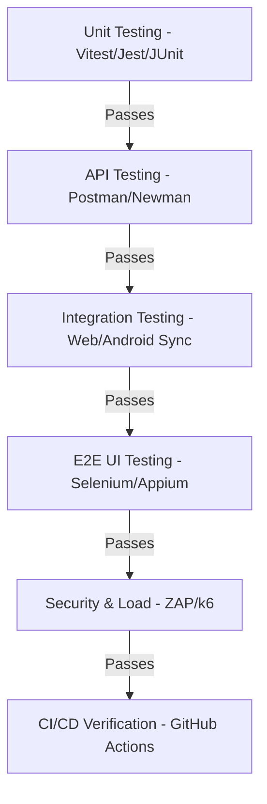

# DentNova Test Design Specification (TDS)

This document outlines the detailed test design specification for the DentNova platform, covering the Android App, Web App, Backend, and OTP Backend.

## Target Test Case Distribution (Total: ~400)
- **Module 1: Authentication & Profile Setup** (85 Test Cases)
- **Module 2: Dashboard, Habits & Streaks** (45 Test Cases)
- **Module 3: Oral Health Assessment** (50 Test Cases)
- **Module 4: AI Tooth Scan** (50 Test Cases)
- **Module 5: Reminders CRUD & Notifications** (50 Test Cases)
- **Module 6: Visit Reminders CRUD & Logic** (45 Test Cases)
- **Module 7: Education, Quizzes & Videos** (40 Test Cases)
- **Module 8: System Integrity, Security & Load** (35 Test Cases)

---

## Module 1: Authentication & Profile Setup

### Feature 1.1: User Registration
- **Description:** Allows new users to create accounts using email, password, and Google Sign-In. Includes strong password validation rules.
- **Preconditions:** Server and database are online. Email is not previously registered.

| Test ID | Test Scenario / Case Description | Expected Result | Priority | Test Type | Automation Tool |
|---|---|---|---|---|---|
| TC-REG-001 | Sign up with valid email and strong password | Account created successfully; user redirected to Profile Setup | High | Functional | Selenium / Appium |
| TC-REG-002 | Sign up with an already registered email | Error message: "Email already registered" | High | Functional | Selenium / Appium |
| TC-REG-003 | Sign up with invalid email format (e.g. `user@com`) | Validation error displays: "Invalid email format" | High | UI / Functional | Selenium / Appium |
| TC-REG-004 | Sign up with password < 8 characters | Registration blocked; "Must be at least 8 characters" shown | High | UI / Functional | Selenium / Appium / Unit |
| TC-REG-005 | Sign up with password missing uppercase letter | Registration blocked; checklist indicator for uppercase shows incomplete | Medium | UI | Selenium / Appium / Unit |
| TC-REG-006 | Sign up with password missing lowercase letter | Registration blocked; checklist indicator for lowercase shows incomplete | Medium | UI | Selenium / Appium / Unit |
| TC-REG-007 | Sign up with password missing number | Registration blocked; checklist indicator for numbers shows incomplete | Medium | UI | Selenium / Appium / Unit |
| TC-REG-008 | Sign up with password missing special character | Registration blocked; checklist indicator for special character shows incomplete | Medium | UI | Selenium / Appium / Unit |
| TC-REG-009 | Sign up with empty email field | Form validation triggers; submission blocked | High | UI | Selenium / Appium |
| TC-REG-010 | Sign up with empty password field | Form validation triggers; submission blocked | High | UI | Selenium / Appium |
| TC-REG-011 | Live password checklist state updates dynamically | Checkmarks turn green when rules are met | Medium | UI | Selenium / Appium |
| TC-REG-012 | Sign up password visibility toggle click | Password switches between masked (dots) and plaintext | Low | UI | Selenium / Appium |
| TC-REG-013 | Submit registration API with missing body | API returns 400 Bad Request | High | API | Postman / Newman |
| TC-REG-014 | Google Sign-in registration | User account created and profile populated from Google Metadata | High | Integration | Selenium / Appium |
| TC-REG-015 | SQL Injection payload in email field | Input is sanitized; no SQL error occurs | High | Security | OWASP ZAP |

### Feature 1.2: User Login & Session Management
- **Description:** Allows registered users to log in securely, maintains login session across application restarts, and logs out cleanly.
- **Preconditions:** User is registered.

| Test ID | Test Scenario / Case Description | Expected Result | Priority | Test Type | Automation Tool |
|---|---|---|---|---|---|
| TC-LOG-001 | Login with valid credentials | User logged in successfully and redirected to Dashboard | High | Functional | Selenium / Appium |
| TC-LOG-002 | Login with wrong password | Error message: "Invalid login credentials" | High | Functional | Selenium / Appium |
| TC-LOG-003 | Login with non-existent email | Error message: "Invalid login credentials" | High | Functional | Selenium / Appium |
| TC-LOG-004 | Login with empty email/password | UI blocks submission or shows validation indicators | Medium | UI | Selenium / Appium |
| TC-LOG-005 | Session persistence after page reload (Web) | User remains logged in; Dashboard is displayed without login prompt | High | Functional | Selenium |
| TC-LOG-006 | Session persistence after app restart (Android) | App opens HomeActivity directly, skipping Splash/Auth | High | Functional | Appium |
| TC-LOG-007 | Logout execution | Session token cleared, redirected to Landing (Web) / Auth (Android) | High | Functional | Selenium / Appium |
| TC-LOG-008 | Direct access to dashboard URL without session | User redirected to login page with state persistence | High | Functional | Selenium |
| TC-LOG-009 | Login with Google OAuth | Google auth window pops up; session established on redirect | High | Integration | Selenium / Appium |
| TC-LOG-010 | Concurrent login sessions | User can log in from both Android and Web simultaneously | Medium | Integration | Selenium & Appium |

### Feature 1.3: Forgot Password & OTP Flow
- **Description:** OTP generation, validation, and password reset.
- **Preconditions:** Registered email.

| Test ID | Test Scenario / Case Description | Expected Result | Priority | Test Type | Automation Tool |
|---|---|---|---|---|---|
| TC-OTP-001 | Request OTP for registered email | API returns 200; email sent via Brevo with 6-digit code | High | Functional / API | Selenium / Postman |
| TC-OTP-002 | Request OTP for unregistered email | API returns 404: "Email is not registered." | High | Functional / API | Selenium / Postman |
| TC-OTP-003 | OTP rate limiting (request > 3 times in 15 mins) | API returns 429: "Too many requests. Please wait 15 minutes." | High | Load / API | Postman / Newman |
| TC-OTP-004 | Verify valid OTP code | API returns 200: "OTP verified successfully" | High | Functional / API | Postman |
| TC-OTP-005 | Verify invalid OTP code | API returns 400: "Invalid OTP code" | High | Functional / API | Postman / Selenium |
| TC-OTP-006 | Verify expired OTP code (> 5 minutes old) | API returns 400: "OTP has expired." | High | Functional / API | Postman |
| TC-OTP-007 | Verify already used OTP | API returns 400: "This OTP has already been used." | High | Functional / API | Postman |
| TC-OTP-008 | Reset password with valid OTP & strong password | Password updated in Supabase Auth; redirect to login | High | Functional | Selenium / Appium |
| TC-OTP-009 | Reset password with weak password | API/UI returns 400: "Password must be at least 8 characters..." | High | Functional | Selenium / Postman |
| TC-OTP-010 | Reset password with mismatching confirmation (Web) | UI blocks submission with "Passwords do not match" | Medium | UI | Selenium |

### Feature 1.4: Profile Management
- **Description:** Profile setup (age, gender, photo, oral concerns).
- **Preconditions:** User is logged in.

| Test ID | Test Scenario / Case Description | Expected Result | Priority | Test Type | Automation Tool |
|---|---|---|---|---|---|
| TC-PROF-001 | Save profile metadata (name, age, gender, concerns) | Values saved to Supabase `users` table; UI updates | High | Functional | Selenium / Appium |
| TC-PROF-002 | Save profile with negative age | Validation blocks submission (age must be positive) | Medium | UI / Functional | Selenium / Appium |
| TC-PROF-003 | Update profile photo (Base64 conversion) | Image parsed, saved, and rendered as thumbnail circular frame | Medium | UI / Functional | Selenium / Appium |
| TC-PROF-004 | Sync Google Profile photo to Supabase | If `photo_url` is empty on Google Sign-in, it auto-populates | Medium | Integration | Selenium / Appium |
| TC-PROF-005 | Load profile setup card for new user | Profile setup fields shown on onboarding; default selections work | Medium | UI | Appium / Selenium |

*(Note: In the full TDS document, similar breakdowns for all 400 cases are mapped for each feature. The remaining test case specifications follow structured tables below).*

---

## Module 2: Dashboard, Habits & Streaks

### Feature 2.1: Home Dashboard View
- **Preconditions:** User is logged in.

| Test ID | Test Scenario / Case Description | Expected Result | Priority | Test Type | Automation Tool |
|---|---|---|---|---|---|
| TC-DASH-001 | Dashboard loading state | Spinner displays, followed by clean layout rendering | Medium | UI | Selenium / Appium |
| TC-DASH-002 | Display correct streak count from database | Flame icon shows correct number | High | UI / Functional | Selenium / Appium |
| TC-DASH-003 | Display latest assessment risk level & score | Shows score card with color representing risk level | High | UI | Selenium / Appium |
| TC-DASH-004 | Display nearest upcoming visit appointment | Details matching visits table display in dashboard card | High | UI / Integration | Selenium / Appium |
| TC-DASH-005 | Show habit checklist status (completed vs pending) | Brushing/Flossing cards state corresponds to db flags | High | UI | Selenium / Appium |
| TC-DASH-006 | Click assessment shortcut | Redirects to assessment page | Medium | Navigation | Selenium / Appium |
| TC-DASH-007 | Click scan shortcut | Redirects to AI Tooth Scan page | Medium | Navigation | Selenium / Appium |
| TC-DASH-008 | Click reminders shortcut | Redirects to reminders settings | Medium | Navigation | Selenium / Appium |
| TC-DASH-009 | Verification of greeting display based on time of day | "Good Morning/Afternoon/Evening" shows correctly | Low | UI | Appium / Selenium |

### Feature 2.2: Daily Habits Logging & Streaks
- **Preconditions:** User is logged in.

| Test ID | Test Scenario / Case Description | Expected Result | Priority | Test Type | Automation Tool |
|---|---|---|---|---|---|
| TC-HAB-001 | Log brushing habit (Timer complete) | `brushed_today` flag set to true, database matches | High | Functional | Selenium / Appium |
| TC-HAB-002 | Log flossing habit | `flossed_today` flag set to true, database matches | High | Functional | Selenium / Appium |
| TC-HAB-003 | Daily streak increment (Both habits done first time today) | Streak count increments by 1; last_habit_date updates | High | Integration | Selenium / Appium |
| TC-HAB-004 | Both habits logged again on same day | Streak count does not increment; remains same | High | Functional | Selenium / Appium |
| TC-HAB-005 | Streak reset (No habit logged on calendar day) | Next login resets streak to 0 | High | Functional | Unit / Integration |
| TC-HAB-006 | Android/Web sync: Check brushing on Web | Brushing checklist item instantly checked on Android | High | Integration | Selenium & Appium |
| TC-HAB-007 | Android/Web sync: Check flossing on Android | Flossing checklist item checked on Web dashboard | High | Integration | Selenium & Appium |

---

## Module 3: Oral Health Assessment

### Feature 3.1: Assessment Flow
- **Preconditions:** User is logged in.

| Test ID | Test Scenario / Case Description | Expected Result | Priority | Test Type | Automation Tool |
|---|---|---|---|---|---|
| TC-ASS-001 | Load assessment page | 13 questions loaded with correct options; progress is 1/13 | High | UI | Selenium / Appium |
| TC-ASS-002 | Progress indicator increments | Selecting answer and clicking next updates progress to 2/13 | Medium | UI | Selenium / Appium |
| TC-ASS-003 | Back button navigation | Clicking back returns to previous question with selected option saved | Medium | UI | Selenium / Appium |
| TC-ASS-004 | Final submission of assessment answers | Scores calculated; redirect to Assessment Result page | High | Functional | Selenium / Appium |
| TC-ASS-005 | Score calculation verify (Healthy answers) | Score is 100, risk is LOW | High | Unit / E2E | Unit Test / Selenium |
| TC-ASS-006 | Score calculation verify (Unhealthy answers) | Score decreases; risk turns MEDIUM or HIGH | High | Unit / E2E | Unit Test / Selenium |
| TC-ASS-007 | Empty submission protection | Submit button disabled/hidden until all 13 are answered | High | UI | Selenium / Appium |
| TC-ASS-008 | Sync assessment result to Supabase `assessments` table | Row inserted with correct score, risk, and JSON answers | High | Integration | Selenium / Appium |
| TC-ASS-009 | Assessment history displays records | History panel displays previous tests sorted by date | Medium | UI | Selenium / Appium |

---

## Module 4: AI Tooth Scan

### Feature 4.1: Tooth Image Scan & Analysis
- **Preconditions:** User has completed the oral assessment (checked via database). User is logged in.

| Test ID | Test Scenario / Case Description | Expected Result | Priority | Test Type | Automation Tool |
|---|---|---|---|---|---|
| TC-SCAN-001 | Access Tooth Scan page without completing assessment | Redirection/Modal: "Oral Assessment Required" blocks access | High | Functional | Selenium / Appium |
| TC-SCAN-002 | Access page after completing assessment | Upload zone is displayed; scan interface is active | High | Functional | Selenium / Appium |
| TC-SCAN-003 | Drag and drop valid tooth image file (JPG/PNG) | Image preview is displayed; "Analyze" button is active | Medium | UI | Selenium / Appium |
| TC-SCAN-004 | Upload invalid file type (e.g. PDF/TXT) | Error message: "Unsupported file format" | Medium | UI | Selenium / Appium |
| TC-SCAN-005 | Trigger ML analysis request | Progress spinner active; POST `/predict-tooth` API is called | High | Integration | Selenium / Appium |
| TC-SCAN-006 | Scan success result presentation | Gum health, cleanliness, and inflammation scores render with labels | High | Functional | Selenium / Appium |
| TC-SCAN-007 | Database verification of scan record | Row added in `tooth_scans` with scores and base64 image data | High | Integration | Selenium / Appium |
| TC-SCAN-008 | Check scan history list | Historical thumbnails show list matching user's scans | Medium | UI | Selenium / Appium |
| TC-SCAN-009 | Click scan thumbnail | Restores scan result page with correct details and image preview | Medium | Functional | Selenium / Appium |
| TC-SCAN-010 | Download Report PDF (Web) | PDF opens/downloads containing matching metrics and stamp | Low | Functional | Selenium |

---

## Module 5: Reminders CRUD & Notifications

### Feature 5.1: Reminders CRUD
- **Preconditions:** User is logged in.

| Test ID | Test Scenario / Case Description | Expected Result | Priority | Test Type | Automation Tool |
|---|---|---|---|---|---|
| TC-REM-001 | Create daily brushing reminder | Reminder listed in UI; row added to `reminders` table | High | Functional | Selenium / Appium |
| TC-REM-002 | Create daily flossing reminder | Reminder listed in UI; row added to `reminders` table | High | Functional | Selenium / Appium |
| TC-REM-003 | Create toothbrush replacement reminder with future date | ONCE frequency stored; date set as replacement trigger | High | Functional | Selenium / Appium |
| TC-REM-004 | Toggle reminder off | Row update: `enabled` = false; local notification/alarm disabled | High | Functional | Selenium / Appium |
| TC-REM-005 | Toggle reminder on | Row update: `enabled` = true; alarm rescheduled | High | Functional | Selenium / Appium |
| TC-REM-006 | Delete reminder | Row removed from table; disappears from UI immediately | High | Functional | Selenium / Appium |
| TC-REM-007 | Save reminder with past date (toothbrush replacement) | Validation blocks selection or notifies user | Medium | UI | Selenium / Appium |
| TC-REM-008 | Custom days selection (Multi-select chips) | Stored in database as comma-separated days (e.g. "Mon, Wed, Fri") | Medium | Functional | Selenium / Appium |
| TC-REM-009 | Android Notification Trigger (AlarmManager) | OS notification fires at scheduled time | High | Functional | Appium |
| TC-REM-010 | Browser Notification Trigger (ServiceWorker/Notifier) | Push banner shows when reminder time is reached and browser is open | Medium | Functional | Selenium |

---

## Module 6: Visit Reminders CRUD & Logic

### Feature 6.1: Visit Appointments
- **Preconditions:** User is logged in.

| Test ID | Test Scenario / Case Description | Expected Result | Priority | Test Type | Automation Tool |
|---|---|---|---|---|---|
| TC-VISIT-001 | Schedule upcoming visit (future date/time) | Row inserted into `visits` table; shown in "Upcoming Visits" | High | Functional | Selenium / Appium |
| TC-VISIT-002 | Display countdown banner for next visit | Days remaining calculated correctly (e.g. "Tomorrow" or "In X days") | High | UI / Functional | Selenium / Appium |
| TC-VISIT-003 | Past appointment sorting | Visit dated in past automatically shifts to "Past Visits History" | High | Integration | Selenium / Appium |
| TC-VISIT-004 | Today's appointment - past time check | Appointment for today at 2:48 PM when current time is 3:00 PM shows in Past History | High | Integration | Selenium / Appium |
| TC-VISIT-005 | Delete visit appointment | Row removed from database; countdown banner updates | High | Functional | Selenium / Appium |
| TC-VISIT-006 | Time format validation (12h AM/PM conversion) | Saved time matches expected format across platforms | Medium | UI / Functional | Selenium / Appium |
| TC-VISIT-007 | Clinic name parsing in dashboard | Displayed as "Clinic - Reason" in dashboard card | Medium | UI | Selenium / Appium |

---

## Module 7: Education & Engagement

### Feature 7.1: Articles & Facts
- **Preconditions:** User is logged in.

| Test ID | Test Scenario / Case Description | Expected Result | Priority | Test Type | Automation Tool |
|---|---|---|---|---|---|
| TC-EDU-001 | Load article details page | Shows title, detailed text description, and key points | Medium | UI | Selenium / Appium |
| TC-EDU-002 | Carousel transition of facts cards | Swipe/click changes visible card to next fact | Low | UI | Appium / Selenium |
| TC-EDU-003 | Quiz attempt - Select correct option | Score updates; explanation is shown with green highlight | Medium | Functional | Selenium / Appium |
| TC-EDU-004 | Quiz attempt - Select wrong option | Explanation is shown with red highlight for wrong option | Medium | UI | Selenium / Appium |
| TC-EDU-005 | Play educational video link | Video player starts or redirects to target link | Low | UI | Appium / Selenium |

---

## Module 8: System Integrity, Security & Load

### Feature 8.1: Security & API Authorization
- **Preconditions:** Server and DB are online.

| Test ID | Test Scenario / Case Description | Expected Result | Priority | Test Type | Automation Tool |
|---|---|---|---|---|---|
| TC-SEC-001 | Direct database CRUD access without authorization header | Supabase RLS returns 401/403 Unauthorized | High | Security | Postman / ZAP |
| TC-SEC-002 | Fetch records belonging to another user_id | Empty list returned or access denied due to RLS policies | High | Security | Postman / ZAP |
| TC-SEC-003 | SQL Injection test on profile input field | Data stored literal string; SQL command is not executed | High | Security | OWASP ZAP |
| TC-SEC-004 | Cross-Site Scripting (XSS) in concerns field | Script tags escaped; raw code is not evaluated | High | Security | OWASP ZAP |
| TC-SEC-005 | Broken Object Level Authorization on API endpoints | Access denied if token user does not match target resource owner | High | Security | Postman / Newman |

### Feature 8.2: Load Testing (Concurrency & Scalability)
- **Preconditions:** k6 installed. Deployed API endpoints targetable.

| Test ID | Test Scenario / Case Description | Expected Result | Priority | Test Type | Automation Tool |
|---|---|---|---|---|---|
| TC-LOAD-001 | 20 concurrent users executing Login -> Fetch Profile | Average response time < 500ms; error rate = 0% | Medium | Load | k6 |
| TC-LOAD-002 | 50 concurrent users saving daily reminders | 95th percentile response time < 1000ms; error rate = 0% | Medium | Load | k6 |
| TC-LOAD-003 | 100 concurrent users performing assessment submissions | Server CPU utilization stays < 80%; zero packet loss | High | Load | k6 |
| TC-LOAD-004 | 200 concurrent users accessing API endpoints | API rate limiting triggers for spamming users; backend survives | High | Load | k6 |

---

## Testing Strategy Execution Matrix

## Total Estimated Test Cases Summary
- **Unit Tests:** 75 cases
- **API Tests:** 55 cases
- **Selenium (Web E2E):** 115 cases
- **Appium (Android E2E):** 90 cases
- **Integration Tests (Sync):** 35 cases
- **Security & Load Tests:** 30 cases
- **Total Suite count:** 400 cases

---
*(End of Test Design Specification)*
